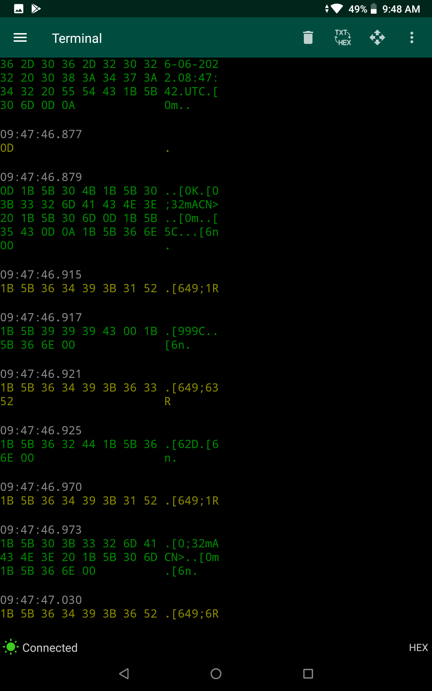
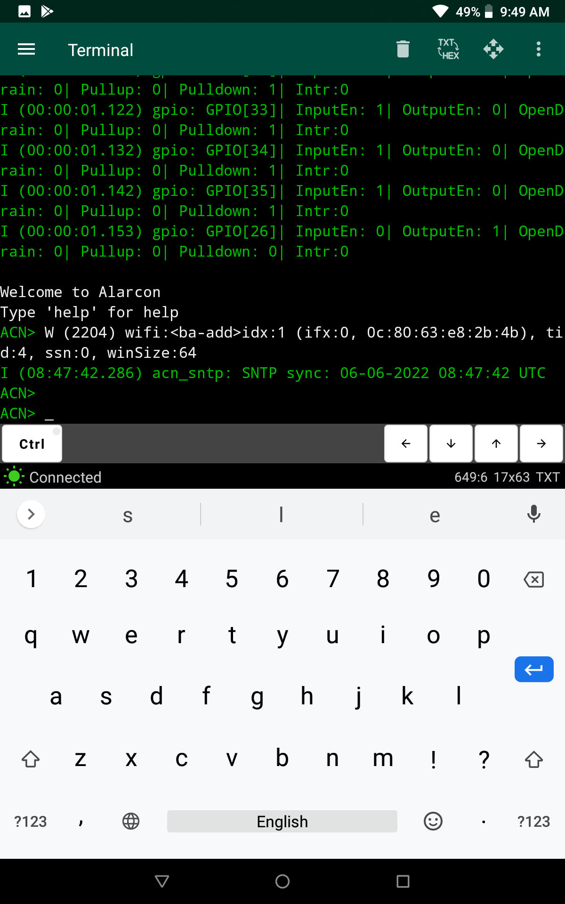
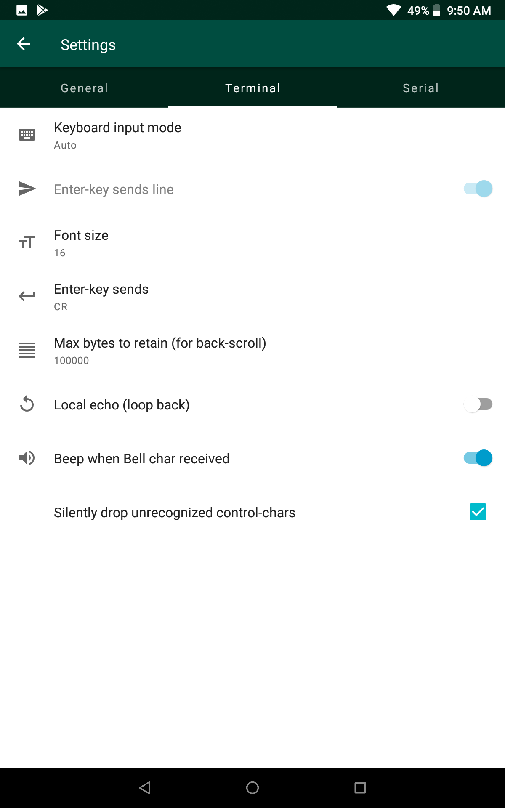
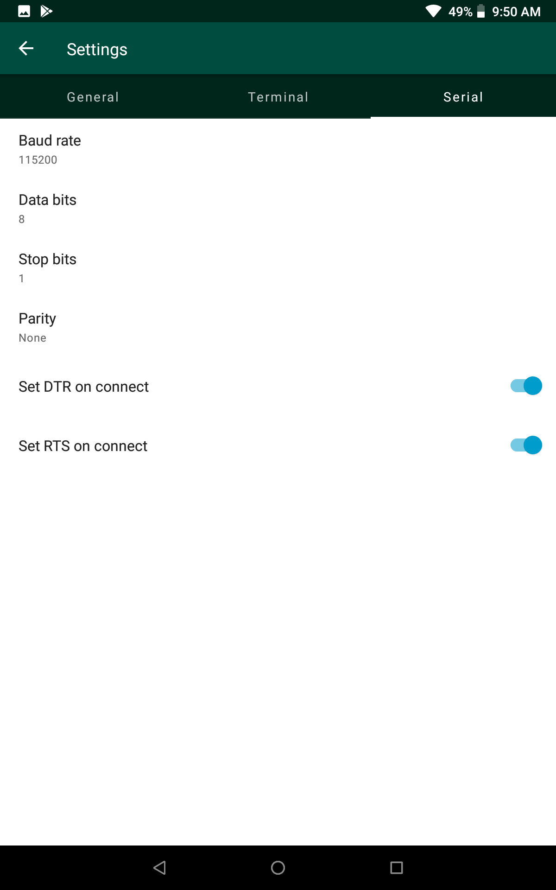

## UsbTerminal Screenshots

Main screen in *Text* mode

---

Main screen in *Hex* mode

---

Log files

---

Selected log file(s)

---

Main screen with keyboard and control-buttons 

---

Navigation drawer

---

Settings/General

---

Settings/Terminal

---

Settings/Serial

---

Built-in help

